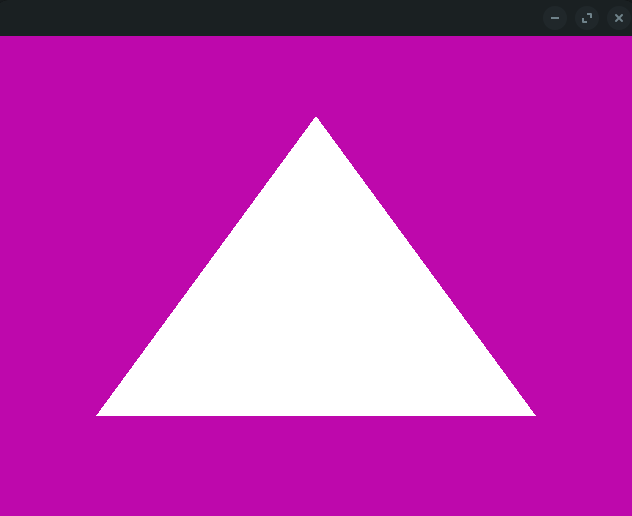

# p5go

2D and 3D graphic development in Golang using Processing Design.




### Requirements

Package required:

* libgl1-mesa-dev
* xorg-dev

## Get Started

You need to initialize a struct that implements Setup and Draw methods:

```go
type model struct {
	/*  */
}

func (m *model) Setup() *p5go.Window {
	return p5go.Canvas(500, 500)
}

func (m *model) Draw(window *p5go.Window) {
	/*  */
}

func init() { runtime.LockOSThread() }

func main() {
	p := p5go.NewProgramm(&model{})

	err := p.Run()
	if err != nil {
		log.Fatal(err)
	}
}
```

Pay attention to
```go
func init() { runtime.LockOSThread() }
```
You need this to make open gl work properly.

At this point you can draw something:

```go
func (m *model) Draw(window *p5go.Window) {
	window.Triangle(100, 100, 200, 200, 300, 300)
}
```

## Features

### Camera

- [x] camera()

### Canvas

- [x] background()


### 2D Primitives
- [x] arc()
- [x] circle()
- [x] ellipse()
- [x] line()
- [x] point()
- [x] quad()
- [x] rect()
- [x] square()
- [x] triangle()

### 3D Primitives
- [x] box()
